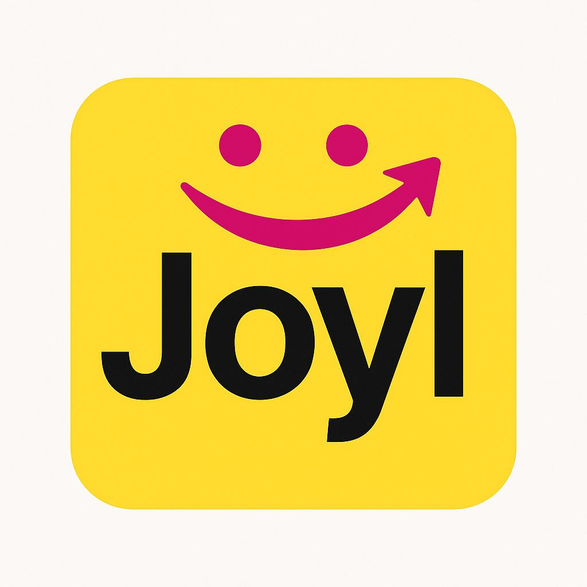

  

# Joyl Programming Language

**Joyl** is a modern, hybrid programming language designed to combine the simplicity of Python with the speed and memory safety of C and Rust. Joyl is built to be beginner-friendly, yet powerful enough for professional use in areas like web development, embedded systems, AI, games, and scripting.

---

## Features

- **Elegant Syntax**: Clean and readable syntax inspired by Python, Ruby, and JavaScript.
- **High Performance**: Compiles to bytecode and optionally to native machine code.
- **Memory Safety**: Ownership-based memory model inspired by Rust, with no garbage collector.
- **Multi-Paradigm Support**: Procedural, Object-Oriented, Functional.
- **Rich Standard Library**: Includes modules for math, strings, I/O, networking, async, and more.
- **Async/Await**: Modern asynchronous programming made easy.
- **Strong Type System**: Static typing with type inference and optional type annotations.
- **Cross-Platform**: Runs on Windows, Linux, Android.
# Joyl Programming Language

**Joyl** is a modern, hybrid programming language designed to combine the simplicity of Python with the speed and memory safety of C and Rust. Joyl is built to be beginner-friendly, yet powerful enough for professional use in areas like web development, embedded systems, AI, games, and scripting.

---

## Features

- **Elegant Syntax**: Clean and readable syntax inspired by Python, Ruby, and JavaScript.
- **High Performance**: Compiles to bytecode and optionally to native machine code.
- **Memory Safety**: Ownership-based memory model inspired by Rust, with no garbage collector.
- **Multi-Paradigm Support**: Procedural, Object-Oriented, Functional.
- **Rich Standard Library**: Includes modules for math, strings, I/O, networking, async, and more.
- **Async/Await**: Modern asynchronous programming made easy.
- **Strong Type System**: Static typing with type inference and optional type annotations.
- **Cross-Platform**: Runs on Windows, Linux, Android.

---

## Code Example

  

# Joyl Programming Language

**Joyl** is a modern, hybrid programming language designed to combine the simplicity of Python with the speed and memory safety of C and Rust. Joyl is built to be beginner-friendly, yet powerful enough for professional use in areas like web development, embedded systems, AI, games, and scripting.

---

## Features

- **Elegant Syntax**: Clean and readable syntax inspired by Python, Ruby, and JavaScript.
- **High Performance**: Compiles to bytecode and optionally to native machine code.
- **Memory Safety**: Ownership-based memory model inspired by Rust, with no garbage collector.
- **Multi-Paradigm Support**: Procedural, Object-Oriented, Functional.
- **Rich Standard Library**: Includes modules for math, strings, I/O, networking, async, and more.
- **Async/Await**: Modern asynchronous programming made easy.
- **Strong Type System**: Static typing with type inference and optional type annotations.
- **Cross-Platform**: Runs on Windows, Linux, Android.
# Joyl Programming Language

**Joyl** is a modern, hybrid programming language designed to combine the simplicity of Python with the speed and memory safety of C and Rust. Joyl is built to be beginner-friendly, yet powerful enough for professional use in areas like web development, embedded systems, AI, games, and scripting.

---

## Features

- **Elegant Syntax**: Clean and readable syntax inspired by Python, Ruby, and JavaScript.
- **High Performance**: Compiles to bytecode and optionally to native machine code.
- **Memory Safety**: Ownership-based memory model inspired by Rust, with no garbage collector.
- **Multi-Paradigm Support**: Procedural, Object-Oriented, Functional.
- **Rich Standard Library**: Includes modules for math, strings, I/O, networking, async, and more.
- **Async/Await**: Modern asynchronous programming made easy.
- **Strong Type System**: Static typing with type inference and optional type annotations.
- **Cross-Platform**: Runs on Windows, Linux, Android.

---

## Code Example

// ======================
// Joyl Language Demo
// File: demo.jl
// ======================

// 1. Basic Output
print("Hello, World!")
print("Welcome to Joyl programming!")

// 2. Variables and Constants
const MAX_USERS = 100
let username = "coder123"
let score = 95.5
let is_active = true

// 3. Collections
let languages = ["Joyl", "Python", "Rust"]
let user = {
    "id": 101,
    "name": "Alex",
    "skills": ["coding", "debugging"]
}

// 4. Functions
fn greet(name) {
    return "Hello, " + name + "!"
}

fn factorial(n) {
    if n <= 1 { return 1 }
    return n * factorial(n - 1)
}

// 5. Control Flow
if score >= 90 {
    print("Excellent!")
} else if score >= 70 {
    print("Good job!")
} else {
    print("Keep practicing!")
}

for lang in languages {
    print("Language: " + lang)
}

let count = 0
while count < 3 {
    print("Count: " + str(count))
    count += 1
}

// 6. Classes
class Point {
    let x
    let y
    
    fn new(x, y) {
        self.x = x
        self.y = y
    }
    
    fn distance_to_origin() {
        return sqrt(self.x**2 + self.y**2)
    }
}

// 7. Using the class
let p = Point.new(3, 4)
print("Distance: " + str(p.distance_to_origin()))

// 8. Error handling
try {
    let result = 100 / 0
} catch err {
    print("Error: " + err)
}

// 9. Main execution
print(greet(username))
print("5! = " + str(factorial(5)))Enter
Enter// ======================
