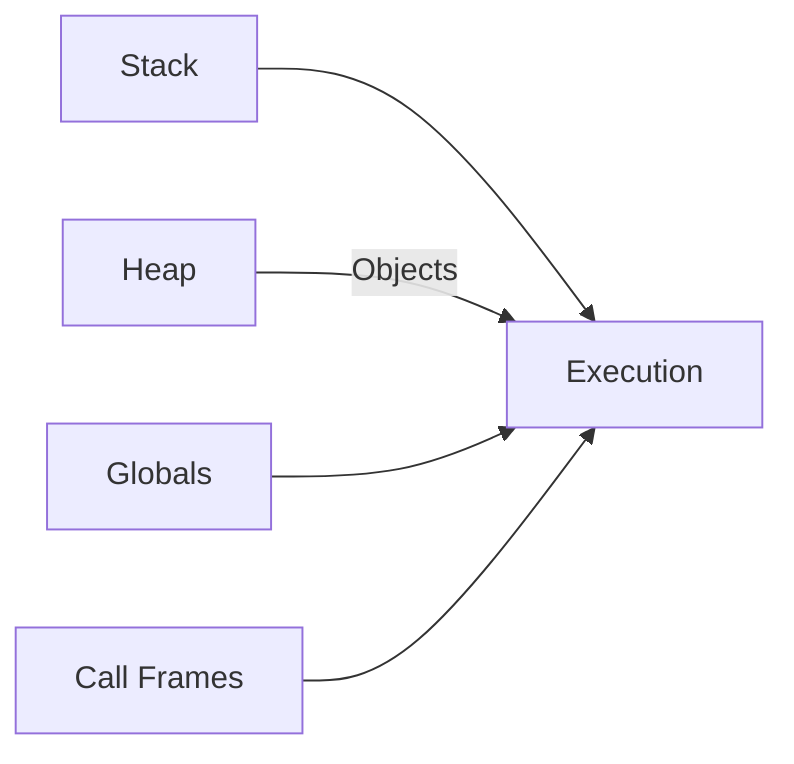

# Joyl Language Architecture

## Compilation Process

### 1. Lexical Analysis (Lexer)
- Converts source code to tokens
- Token types:
  - Identifiers: `variable`, `function`
  - Keywords: `let`, `fn`, `if`
  - Literals: `42`, `"text"`, `true`
  - Operators: `+`, `-`, `==`
  - Delimiters: `(`, `)`, `{`, `}`

Example token stream:
```joyl
[LET, IDENT("x"), EQ, INTEGER(5), SEMI]
```

### 2. Parsing
- Uses recursive descent parsing
- Builds Abstract Syntax Tree (AST)
- Key AST nodes:
  - `VarDecl`: Variable declaration
  - `Function`: Function definition
  - `BinaryOp`: Operations like `a + b`
  - `If`: Conditional statements

Sample AST:
```python
Program(
  statements=[
    VarDecl(
      name="x",
      value=BinaryOp(
        left=Integer(2),
        op=PLUS,
        right=Integer(3)
    )
  ]
)
```

### 3. Code Generation
- Produces stack-based bytecode
- Bytecode instructions:
  - Stack ops: `PUSH`, `POP`, `DUP`
  - Arith ops: `ADD`, `SUB`, `MUL`
  - Control flow: `JMP`, `JMP_IF_FALSE`
  - Functions: `CALL`, `RETURN`

Example bytecode:
```
PUSH 2
PUSH 3
ADD
STORE 0
```

## Virtual Machine Architecture

### Memory Model


### Execution Flow
1. Initialize VM state
2. Load bytecode
3. Process instructions:
   - Fetch
   - Decode
   - Execute
4. Handle runtime exceptions

## Key Data Structures

### 1. Token
```python
@dataclass
class Token:
    type: TokenType
    value: Any
    line: int
    column: int
```

### 2. AST Nodes
```python
@dataclass
class Function(ASTNode):
    name: str
    params: List[Tuple[str, str]]
    body: Block
```

### 3. Bytecode Format
```
OPCODE_ARG (1 byte opcode + 1 byte arg)
----------------------------
| PUSH | 0x02 | 0x05 | ... |
----------------------------
```

## Optimization Pipeline

| Stage         | Technique               | Example              |
|---------------|-------------------------|----------------------|
| Parsing       | Constant folding        | `2 + 3` → `5`        |
| Compilation   | Dead code elimination   | Remove unused vars   |
| Runtime       | Inline caching          | Faster property access|

## Debugging Support
- Source maps
- Stack traces
- REPL mode
- Bytecode disassembler

## Example End-to-End Flow

1. Source:
```joyl
let x = 2 + 3
```

2. Tokens:
```
LET, IDENT("x"), EQ, INTEGER(2), PLUS, INTEGER(3), SEMI
```

3. AST:
```python
VarDecl(
  name="x",
  value=BinaryOp(
    left=Integer(2),
    op=PLUS,
    right=Integer(3)
)
```

4. Bytecode:
```
PUSH 2
PUSH 3
ADD
STORE 0
```

5. Execution:
- Stack: [2, 3]
- After ADD: [5]
- After STORE: []
